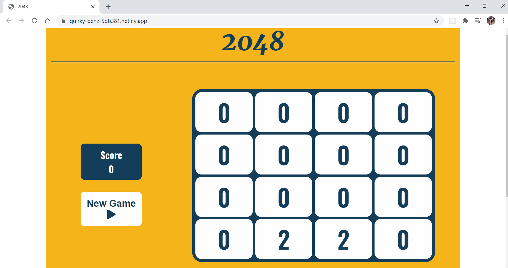

# 2048-JavaScript
Based on the popular game 2048 by Gabriele Cirulli. The game's objective is to slide numbered tiles on a grid to combine them to create a tile with the number 2048. Here is a JavaScript version!

# You can Play here https://quirky-benz-5bb381.netlify.app/

# 
# License
 2048 is licensed under the [MIT LICENSE](LICENSE)
